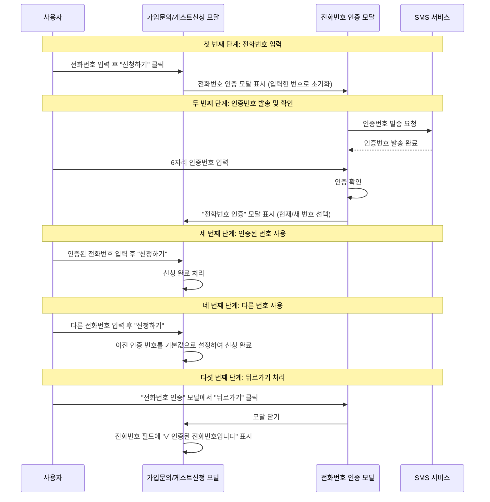

- 'PhoneVerification' 저는 이 모델의 "phoneNumber, isVerified" 미 두 패드를 보고 인증 된 전화번호를 처리를 하고 있는데
- 전화번호 인증 첫 번째 단계
  - "가입 문의, 게스트 신청 모달"에서 전화번호를 입력하고 "신청하기" 누르면
  - 그 다음 모달에 이전 모델에서 작성한 전화번호가 초기 번호로 입력이 됨
- 전화번호 인증 두 번째 단계
  - 인증번호를 발송하고 배송 된 인증번호 여섯 짜리를 입력해서 인증 확인을 한다
  - 위에 인증 과정을 걸치면 "전화번호 인증"이라는 모달이 나옴
  - 여기에서 현재 전화번호를 사용 할지 새 전화번호로 인증 할지 선택 가능
- 전화번호 인증 세 번째 단계
  - "가입 문의, 게스트 신청 모달"에서 전화번호를 이미 인증 된 전화번호 있을 때
    - 전화번호 필드에 이미 인증 된 전화번호를 입력 했을 때 "신청하기" 이후
- 전화번호 인증 네 번째 단계
  - "가입 문의, 게스트 신청 모달"에서 전화번호를 이미 인증 된 전화번호가 있을 때
    - 인증 된 전화번호가 아닌 다른 전화번호를 입력을했을 때 "신청하기" 가능
  - 다른 전화번호를 작성 하고 "신청하기" 누르면 이전에 인증 했던 전화번호가 기본적으로 설정이 되어 있음
- 전화번호 인증 다섯 번째 단계
  - "가입 문의, 게스트 신청 모달"에서 전화번호를 이미 인증 된 전화번호가 있을 때
    - "전화번호 인증"이라는 모달이 나옴
    - 여기에서 뒤로 가기 누르면
    - 전화번호 필드에 "✓ 인증된 전화번호입니다" 라는 문구가 입력 되어 있음

